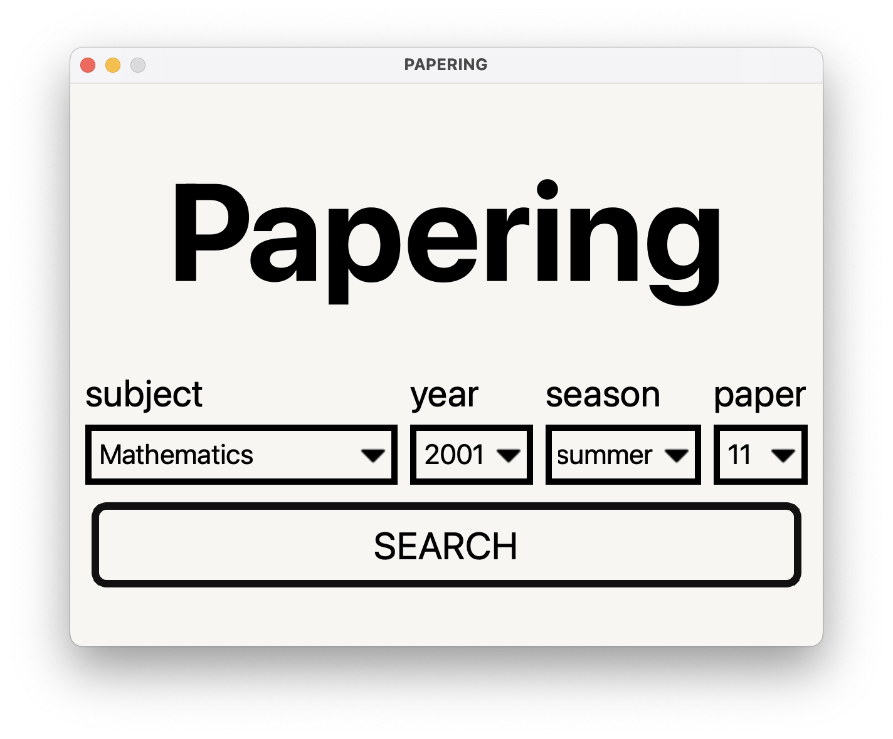

# Papering

**Papering** is a lightweight, Python-powered application designed to streamline the process of searching for A-Level past papers. By automating the generation of paper URLs and launching them directly in the browser, Papering eliminates the need for manual searching and clicking through multiple pages.

Whether you're preparing for your next exam or helping others revise, Papering makes it quick and effortless to locate the specific paper or mark scheme you need.



## 🔍 Features

- Automatically generates and opens the URL for A-Level past papers and mark schemes
- Supports a wide range of subjects including:
  - Mathematics
  - Computer Science
  - And many more (with support easily extendable)
- Clean, user-friendly interface for input selection

## 🎯 Available Options

When running the application, you can specify the following parameters:

- **Subject** – Choose from the available subjects (e.g., Math, CS)
- **Year** – Select the exam year (e.g., 2022, 2023)
- **Season** – Choose between different seasons (e.g., Summer, Winter)
- **Paper** – Specify the paper type or number (e.g., Paper 1, Paper 2, MS for mark scheme)

## 💡 Motivation

This project was created out of personal need. As a student, I found the process of manually finding each paper and its corresponding mark scheme to be time-consuming and repetitive. Papering was built to automate this workflow, saving time and allowing students to focus more on studying and less on searching.

## 🚀 Getting Started

> If you are on Mac, you can directly download the dmg file and install it on your mac.

Otherwise, follow the steps to run app for testing purpose.

1. **Clone the repository**

```bash
git clone https://github.com/yourusername/papering.git
cd papering
```

2. **Run the application**

```bash
python papering.py
```

3. **Follow the prompts** to select the subject, year, season, and paper type.

The application will automatically open the corresponding paper or mark scheme in your default browser.

## 📦 Requirements

- Python 3.6+
- PyQT6
- webbrowser

## 📚 Future Improvements

- Caching frequently accessed papers
- Subject list auto-sync from source site
- CLI improvements and config file support

## 🤝 Contributions

Contributions are welcome! If you have suggestions, bug reports, or new features you'd like to add, feel free to open an issue or submit a pull request.

## 📄 License

This project is licensed under the MIT License.